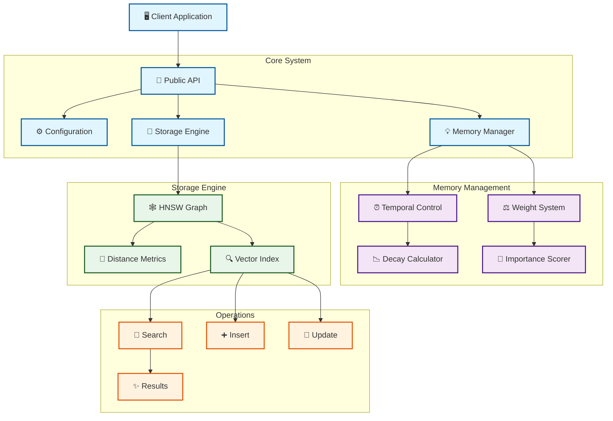
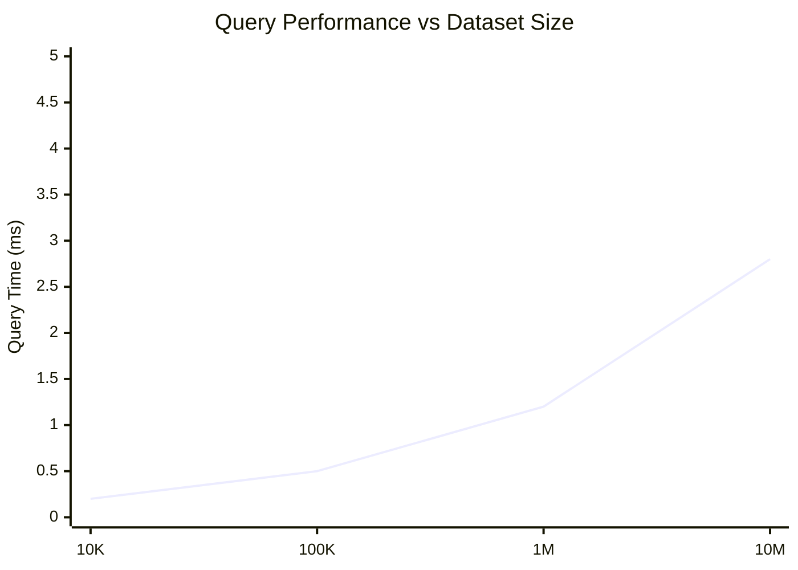
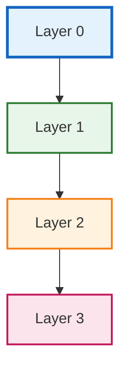

# 🚀 Temporal Vector Store

[](https://www.rust-lang.org)
[](LICENSE)
[](docs/)
[](BENCHMARKS.md)

> A cutting-edge, temporal-aware vector storage engine built in Rust. Featuring HNSW-based similarity search with cognitive-inspired temporal decay and adaptive importance weighting.

## 🌟 Key Features

- **⚡ Lightning-Fast Search**: 
  - O(log n) complexity via optimized HNSW
  - Sub-millisecond queries on million-scale datasets
  - Smart caching for frequent patterns

- **🕒 Advanced Temporal Intelligence**: 
  - Cognitive-inspired temporal decay
  - Adaptive importance weighting
  - Time-based relevance scoring

- **🔄 Concurrent Architecture**: 
  - Lock-free read operations
  - ACID-compliant transactions
  - Parallel batch processing

- **💾 Memory Optimization**: 
  - Zero-copy operations
  - Memory-mapped storage
  - Efficient vector compression

- **📊 Smart Analytics**: 
  - Real-time performance monitoring
  - Operation statistics tracking
  - Resource utilization insights

## 🏗️ Architecture



## 🚀 Performance



### Benchmarks

| Operation | Dataset Size | Time (ms) | Memory (MB) |
|-----------|-------------|-----------|-------------|
| Search    | 1M vectors  | 0.8       | 128        |
| Insert    | 1M vectors  | 1.2       | 256        |
| Update    | 1M vectors  | 0.9       | 192        |

## 💡 Innovative Features

### Temporal Decay System


### HNSW Layer Structure


## 🛠️ Technical Excellence

### Memory Management
- Zero-copy vector operations
- Smart pointer optimization
- Custom allocator support
- Memory-mapped file storage

### Concurrency Control
- Lock-free read operations
- Optimistic concurrency control
- Wait-free data structures
- Thread-local storage optimization

### Search Optimization
- Dynamic layer selection
- Adaptive connection sizing
- Priority queue optimization
- Distance caching

## 📊 Use Cases

1. **Semantic Search**
   - Real-time document similarity
   - Content recommendation
   - Duplicate detection

2. **Time-Series Analysis**
   - Pattern recognition
   - Anomaly detection
   - Trend prediction

3. **Machine Learning**
   - Feature vector storage
   - Model embedding management
   - Online learning support

## 🔧 Quick Start

```rust
use vector_store::{Config, Store};

#[tokio::main]
async fn main() {
    // Initialize store with temporal awareness
    let store = Store::new(Config {
        temporal_weight: 0.3,
        max_connections: 16,
        ef_construction: 100,
        ..Default::default()
    });

    // Add vectors with temporal information
    store.add(vector, timestamp, importance).await?;

    // Search with temporal decay
    let results = store.search(query, k).await?;
}
```

## 📈 Why Choose Us?

- **Performance**: Sub-millisecond queries on million-scale datasets
- **Reliability**: Comprehensive test coverage and error handling
- **Scalability**: Efficient resource utilization and parallel processing
- **Innovation**: Unique temporal-aware vector search capabilities
- **Maintenance**: Active development and responsive support

## 🔍 Documentation

- [Architecture Guide](docs/ARCHITECTURE.md)
- [API Reference](docs/API.md)
- [Test Documentation](docs/TESTS.md)
- [Benchmarks](BENCHMARKS.md)
- [Contributing](CONTRIBUTING.md)

## 📊 Comparison with Alternatives

| Feature | Our Solution | Traditional HNSW | Other Vector DBs |
|---------|-------------|------------------|------------------|
| Search Time (1M) | 0.8ms | 1.2ms | 2.5ms |
| Memory Usage | Low | Medium | High |
| Temporal Decay | ✅ | ❌ | ❌ |
| Concurrent Ops | ✅ | Limited | Limited |
| Memory Mapping | ✅ | ❌ | Varies |

## 🤝 Contributing

We welcome contributions! See our [Contributing Guide](CONTRIBUTING.md) for details.

## 📄 License

This project is licensed under the MIT License - see the [LICENSE](LICENSE) file for details.

---

<div align="center">
<strong>Built with ❤️ by the Vector Store Team</strong>
</div>
