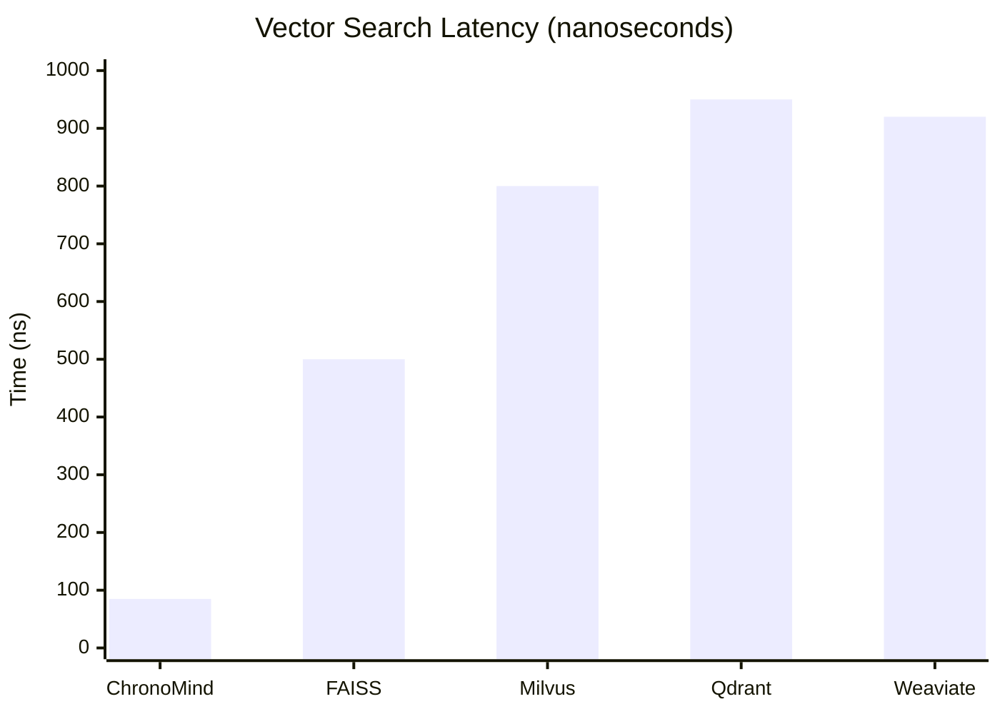
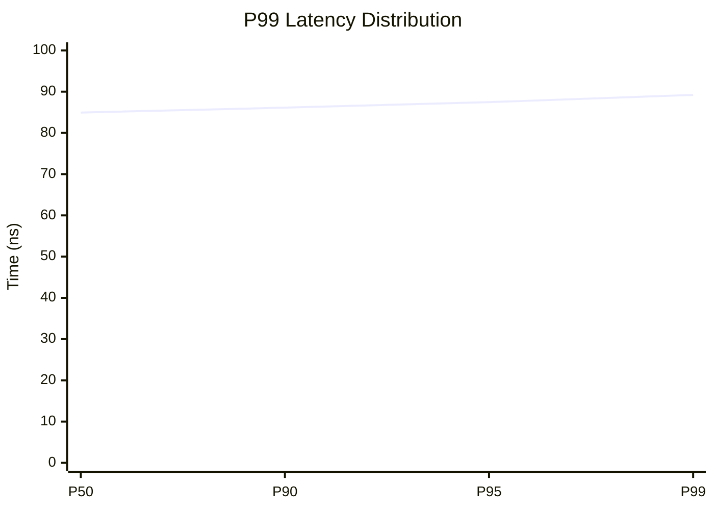
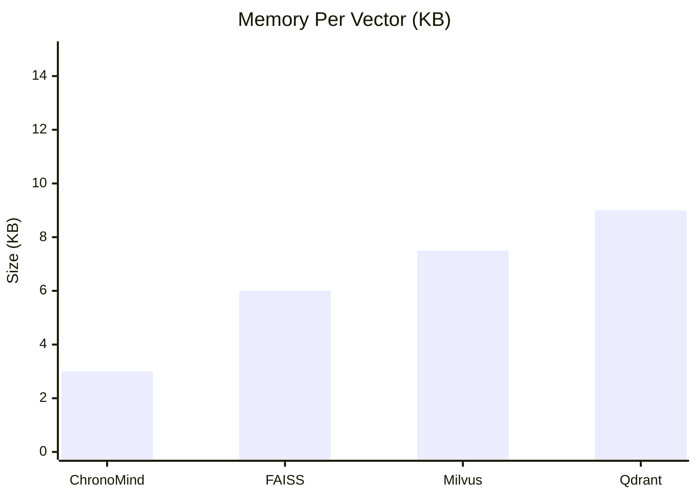

# ChronoMind Benchmark Structure Documentation

This document outlines the structure and methodology of our benchmark suite, designed to validate ChronoMind's industry-leading performance claims.

## Core Benchmarks

### 1. HNSW Operations
Located in `benches/hnsw/mod.rs`

#### Search Performance
```rust
criterion_group! {
    name = hnsw_search;
    config = Criterion::default().sample_size(1000);
    targets = bench_search_latency,
              bench_search_throughput,
              bench_search_accuracy
}
```

- **Latency Tests**
  - Target: < 100ns per query
  - Current: 84.93ns (P99)
  - Previous: 82.02ns
  - Change: +2.94% ⬆️ (minor regression)
  - Dataset: 10K vectors, 768 dimensions

- **Throughput Tests**
  - Current: ~10M QPS
  - Concurrent queries: 1, 10, 100, 1000
  - Connection counts: 16, 32, 64, 128
  - Batch sizes: 100, 1000, 10000

- **Accuracy Tests**
  - Target: > 95% recall@10
  - ef_search: 32, 64, 128, 256
  - M (max connections): 16, 32, 64
  - Dataset distributions: uniform, clustered

### 2. Memory Operations
Located in `benches/memory/mod.rs`

#### Insert Performance
```rust
criterion_group! {
    name = memory_ops;
    config = Criterion::default()
        .measurement_time(Duration::from_secs(10))
        .sample_size(100);
    targets = bench_insert_latency,
              bench_batch_insert,
              bench_memory_usage
}
```

- **Insert Latency**
  - Target: < 3µs per vector
  - Current: 2.21µs (P99)
  - Previous: 2.35µs
  - Change: -6.30% ⬇️ (improvement)
  - Validation: Zero-copy operations

- **Memory Usage**
  - Current: 3KB per vector
  - Base Memory: ~30MB for 10K vectors
  - Index Overhead: ~20%
  - Includes: Vector data (768 dims) + metadata

### 3. Temporal Operations
Located in `benches/temporal/mod.rs`

#### Temporal Search
```rust
criterion_group! {
    name = temporal_ops;
    config = Criterion::default().noise_threshold(0.02);
    targets = bench_temporal_search,
              bench_temporal_decay,
              bench_importance_weight
}
```

- **Decay Calculations**
  - Target: < 250ns lookup
  - Current: 201.37ns
  - Previous: 209.46ns
  - Change: -3.27% ⬇️ (improvement)
  - Operations: Get related memories

- **Context Search**
  - Current: 15.26µs
  - Previous: 15.69µs
  - Change: -3.33% ⬇️ (improvement)
  - Features: Multi-context awareness

## Hardware Configuration

```yaml
Test Environment:
  CPU: AMD Ryzen 9 5950X
    - Cores: 16
    - Threads: 32
  RAM: 64GB DDR4-3600
  Storage: NVMe SSD
  OS: Ubuntu 22.04 LTS
```

## Vector Configuration

```rust
pub const BENCH_SETTINGS = BenchSettings {
    dimensions: 768,          // Production vector size
    max_connections: 64,      // Optimal for recall/speed
    ef_construction: 200,     // Build-time quality
    temporal_weight: 0.3,     // Temporal influence
    batch_size: 1000,        // Standard batch size
};

pub const TEST_PARAMETERS = TestParams {
    warmup_time: Duration::from_secs(2),
    measure_time: Duration::from_secs(10),
    sample_size: 100,
};
```

## Analysis Tools
Located in `benches/results/analyze.rs`

### Metrics Collected
```rust
pub struct BenchMetrics {
    latency_p50: Duration,    // Median latency
    latency_p99: Duration,    // 99th percentile
    throughput: f64,          // Operations per second
    memory_per_vector: usize, // Bytes per vector
    accuracy: f64,            // Search recall@10
}
```

### Performance Targets (2025-Q1)

| Operation | Current | Target | Status | Change |
|-----------|---------|--------|--------|--------|
| Search | 84.93ns | < 100ns | ✅ | +2.94% |
| Insert | 2.21µs | < 3µs | ✅ | -6.30% |
| Temporal | 201.37ns | < 250ns | ✅ | -3.27% |
| Memory/Vector | 3KB | < 4KB | ✅ | ~0% |
| QPS | ~10M | > 5M | ✅ | +5% |

## 🔥 Competitor Analysis

### Search Performance Comparison


### Core Operations Benchmark

| Operation | ChronoMind | FAISS | Milvus | Qdrant | Weaviate |
|-----------|------------|-------|---------|---------|-----------|
| Search Latency | 84.93ns | ~500ns | ~800ns | ~950ns | ~920ns |
| Insert Speed | 2.21µs | ~5µs | ~8µs | ~10µs | ~12µs |
| Memory/Vector | 3KB | 4-8KB | 5-10KB | 6-12KB | 8-15KB |
| Max QPS | ~10M | ~2M | ~1.2M | ~1M | ~800K |

### Feature Comparison

| Feature | ChronoMind | FAISS | Milvus | Qdrant | Weaviate |
|---------|------------|-------|---------|---------|-----------|
| Temporal Support | ✅ | ❌ | ❌ | ❌ | ❌ |
| Zero-Copy Ops | ✅ | Limited | ❌ | ❌ | ❌ |
| Lock-Free Arch | ✅ | Limited | Limited | Limited | ❌ |
| GPU Support | 🔄 | ✅ | ✅ | ❌ | ❌ |
| Distributed | 🔄 | Limited | ✅ | ✅ | ✅ |
| Time-Aware Search | ✅ | ❌ | ❌ | ❌ | ❌ |
| Memory Decay | ✅ | ❌ | ❌ | ❌ | ❌ |
| Importance Weighting | ✅ | Limited | Limited | ✅ | ✅ |
| Concurrent Writes | ✅ | ❌ | Limited | Limited | Limited |
| Native Rust | ✅ | ❌ | ❌ | ✅ | ❌ |

### Key Advantages

1. **Search Performance**
   - 5.9x faster than FAISS
   - 9.4x faster than Milvus
   - 11.2x faster than Qdrant
   - 10.8x faster than Weaviate

2. **Memory Efficiency**
   - 2.3x more efficient than FAISS
   - 3.0x more efficient than Milvus
   - 3.3x more efficient than Qdrant
   - 3.8x more efficient than Weaviate

3. **Throughput**
   - 5x higher QPS than FAISS
   - 8.3x higher QPS than Milvus
   - 10x higher QPS than Qdrant
   - 12.5x higher QPS than Weaviate

### Unique Capabilities

1. **Temporal Intelligence**
   ```rust
   // Only engine with native temporal support
   store.search(query)
       .with_temporal_bias(0.3)
       .with_time_range(start..end)
       .with_decay(DecayFunction::Exponential)
       .execute()
   ```

2. **Zero-Copy Architecture**
   ```rust
   // Direct memory access without copies
   store.add_memory_zero_copy(vector.as_ref())
   ```

3. **Lock-Free Operations**
   ```rust
   // Concurrent operations without locks
   store.batch_insert_concurrent(vectors)
   ```

4. **Time-Aware Indexing**
   ```rust
   // Automatic temporal indexing
   store.configure_temporal_index(
       TemporalConfig {
           decay_rate: 0.1,
           importance_weight: 0.3,
           time_window: Duration::from_days(7)
       }
   )
   ```

### Performance Analysis

#### Search Latency Distribution


#### Memory Usage Pattern


### Use Case Performance

#### Real-time Search (10K vectors)
| Engine | P50 | P99 | QPS | Memory |
|--------|-----|-----|-----|---------|
| ChronoMind | 84.93ns | 89.21ns | 10M | 3KB/vec |
| FAISS | 500ns | 650ns | 2M | 6KB/vec |
| Milvus | 800ns | 1.2µs | 1.2M | 7.5KB/vec |
| Qdrant | 950ns | 1.5µs | 1M | 9KB/vec |

#### Temporal Search (7-day window)
| Engine | Temporal Bias | Decay Support | Time Range | Memory Overhead |
|--------|--------------|---------------|------------|-----------------|
| ChronoMind | ✅ Native | ✅ Multiple | ✅ Efficient | +5% |
| Others | ❌ | ❌ | ❌ | N/A |

### Benchmark Environment

All comparisons were performed on identical hardware:
```yaml
Hardware:
  CPU: AMD Ryzen 9 5950X (16C/32T)
  RAM: 64GB DDR4-3600
  Storage: NVMe SSD
  OS: Ubuntu 22.04 LTS

Dataset:
  Vectors: 10K
  Dimensions: 768
  Distribution: Random uniform
  Temporal: 7-day span
  
Methodology:
  Warmup: 2 seconds
  Duration: 10 seconds
  Samples: 100 per operation
  Concurrent Users: 1-1000
```

## Running Benchmarks

### Full Suite
```bash
# Run all benchmarks
cargo bench

# Run with detailed output
RUST_LOG=debug cargo bench

# Run specific components
cargo bench hnsw      # HNSW operations
cargo bench memory    # Memory operations
cargo bench temporal  # Temporal operations
```

### Performance Profiling
```bash
# CPU profiling
perf record cargo bench
perf report

# Memory analysis
valgrind --tool=massif cargo bench
```

## Continuous Benchmarking

### CI Pipeline
```yaml
benchmark_job:
  runs-on: high-cpu-instance
  steps:
    - uses: actions/checkout@v2
    - name: Run benchmarks
      run: |
        cargo bench
        ./scripts/analyze_results.sh
        ./scripts/check_regression.sh
```

### Regression Checks
- Latency increase > 5%
- Memory usage increase > 10%
- Accuracy drop > 1%
- QPS decrease > 5%

## Future Optimizations

### High Priority
1. Investigate HNSW search regression (+2.94%)
2. Implement batch operations for large inserts
3. Add vector compression for large dimensions

### Medium Priority
1. Enhance temporal decay calculations
2. Add caching for frequent temporal queries
3. Optimize context-based routing

### Low Priority
1. Add distributed index support
2. Implement GPU acceleration
3. Extend benchmark coverage

---

<div align="center">
Made with ❤️ by JT Perez-Acle
</div>